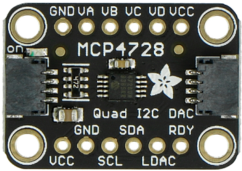

# node-red-contrib-iiot-rpi-mcp4728

[](https://nodered.org)


A Node-Red node for mcp4728 12bit digital to analog converter<br>



Example  **MCP4728** module from [adafruit](https://learn.adafruit.com/adafruit-mcp4728-i2c-quad-dac)

## Output Ranges
- 4 output channel
- Internal Ref. Output 2048mV/4095
- Internal Ref. Output 4096mV/4095
- External Ref. Output VDD/4095

## Installation
Install with Node-Red Palette Manager or npm command:
```
cd ~/.node-red
npm install node-red-contrib-iiot-rpi-mcp4728
```

## Usage
- This node works on Raspberry Pi with 32bit or 64bit OS.
- Enable I2C with raspi-config.

## Test Enviroment
- Raspberry Pi 4
- Raspberry Pi OS (64bit) Debian v11 (bullseye)
- Raspberry Pi OS (32bit) Debian v11 (bullseye)
- Node-Red: v2.2.2
- node.js: v14.19.3<br>
If you have problems with other enviroments, open issue on github.
